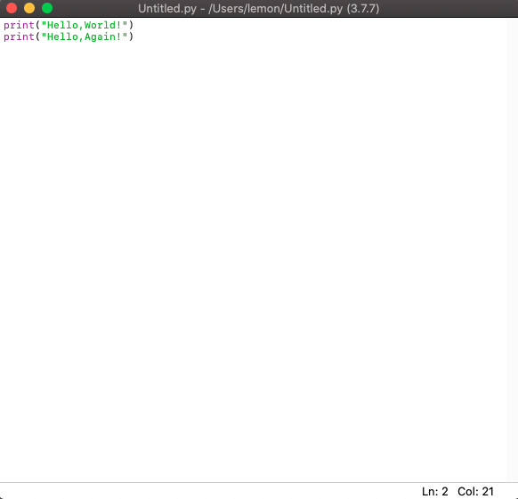
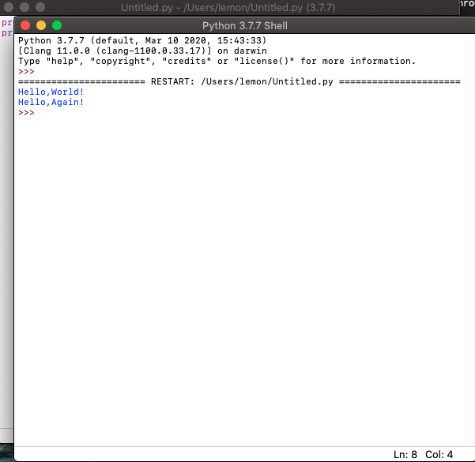

# 我的神奇Python教程(5)

我的天哪，你不会以为今天能开始讲什么正文吧？

我今天就要讲一下关于IDE的使用！

那什么是IDE呢？

IDE就是集成开发环境！可以把脚本编写，脚本运行集成在一起！

而我们伟大的Python就自带了一个IDE：IDLE！！！

如果是Windows，就在开始菜单Python文件夹里找；如果是Mac & Linux，就在终端里输入：

```bash
$ idle  # 如果你的电脑上有多个Python版本，也可以用idle3
# 如果你的Linux没有桌面环境或Tkinter库，是无法运行的
# 如果想检测有没有tkinter,打开解释器，输入`import tkinter`
# 如果没有事发生，就证明有这个库
```

这样，就打开了IDLE！

现在，我们看到了，我们看到了！Python解释器！

这个Python解释器是带有语法高亮和智能提示的！

现在，点击菜单栏中的File选项！新建或打开一个文件！

然后，就可以开始编写了！像这样：



他也有语法高亮！智能提示是可以设置的。

然后，点击Run选项，选择'run module'，然后，然后！它运行了！这是个傻瓜式的操作：



有人说：Run -> Run Module 这种方式还是太麻烦了，怎么办？

好！我们可以直接按F5！结果是一样的！

通过今天的学习，你学会了使用Python自带的IDLE！！！麻麻再也不用担心我没有好用的编辑器了！

[上一页](https://clxon.github.io/python/4) [下一篇](https://clxon.github.io/python/6)