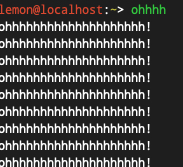
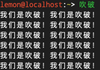

# 我的神奇Python教程(5)

好了同志们，IDE啥的都讲完了，所以....

我们今天来讲...变量！



那什么是变量呢？变量，就是一个存放值的容器。

> 变量可以通过变量名访问。在指令式语言中，变量通常是可变的。 ——百度百科

哦天哪，我想你已经迫不及待的要去~~霍霍~~使用变量了吧！（并没有）

看——————程——————序——————！

```python
a = 1
b = 1
print(a + b)
```

Python的变量是弱类型的，所以我觉得你应该能看懂上面的程序！

a 和 b ，就是，就是！我们伟大的变 量！

因此得出，变量可以装数值！再看！

```python
a = '世上本没有路，走的人多了，便有了路。'
print(a)
```

来，动动你聪明的小脑袋瓜子，对！这个变量a就装着名言警句！



再看！

```python
a = 1
print(a)
a = 2
print(a)
```

> 运行结果: 1 (换行) 2

哦天哪，你是不是在想，a都等于一了，它怎么能等于2呢？

变量变量，顾名思义，就是能变得量。`a=1`和数学意义上的`a=1`不同，它表示把 `1` 这个值装进 `a` 这个容器(变量)里。

`a=1`后`a=2`就表示把a原来的值撇了，换成2。

今天，你~~应该~~学会了一个神奇的东西————变  量！

[上一页](https://clxon.github.io/python/5) [下一篇](https://clxon.github.io/python/7)